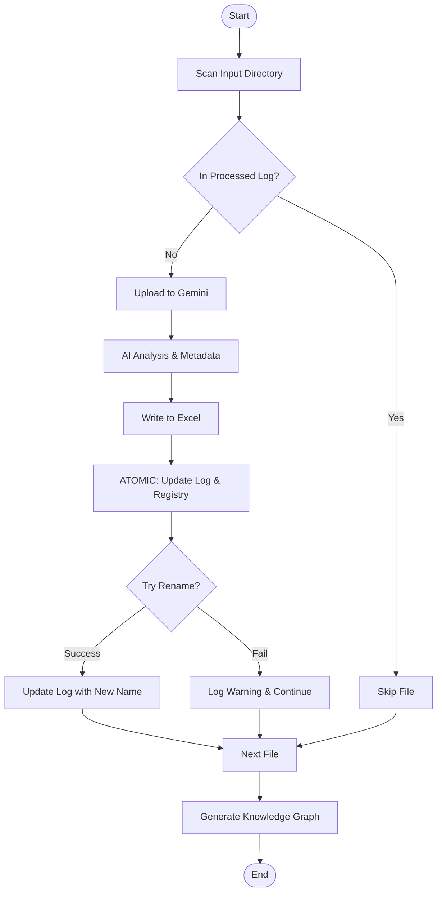

# Scientific Paper Analysis Tool (Gemini-Powered)

Automate the extraction of structured data from scientific PDFs using Google's **Gemini 2.5 Flash**. This tool transforms a chaotic folder of research papers into a structured, publication-quality Excel database, complete with an interactive Knowledge Graph and automated Citation Management.

## 🚀 Key Features

-   **AI-Powered Deep Analysis**: Extracts complex scientific metadata including:
    -   Central Problem, Hypothesis, and Objectives.
    -   Independent/Dependent Variables (X/Y).
    -   Methodology & Tools.
    -   Key Results and Conclusions.
    -   **Short Summaries** and **Glossaries** of technical terms.
-   **Pub-Quality Knowledge Graph**: 
    -   Builds a dynamic NetworkX graph linking papers to technical concepts.
    -   Uses **adjustText** physics simulation to prevent label overlap.
    -   Auto-embedded into the Excel workbook with customizable Obsidian-style dark aesthetics.
-   **Smart Excel Dashboard**:
    -   **Dashboard**: Clickable Table of Contents with summaries and glossary previews.
    -   **Individual Sheets**: Dedicated pages for each paper with structured data.
    -   **Strict Deduplication**: Automatically updates existing sheets instead of creating duplicates.
-   **Robust File Management**:
    -   **Content-Based Deduplication**: Uses MD5 hashing to move identical PDFs to a `duplicates/` folder, even if filenames differ.
    -   **Automated Renaming**: Standardizes files to `Author-Year-ShortTitle.pdf`.
    -   **Safe Grounding**: Uses Google Search to verify citations (DOI, Journal, etc.) without losing the original paper's identity.
    -   **Garbage Collection**: Automatically removes "Zombie" log entries if files are deleted from the disk.

## 📋 Prerequisites

-   **Python 3.9+**
-   A **Google Cloud API Key** with access to Gemini 2.5 Flash.

---
## 🏗️ Architecture & Workflow

The application uses a modular architecture with strict atomic logging to ensure data safety.



### Key Modules
*   **`main.py`**: The central orchestrator that manages the high-level flow.
*   **`state_manager.py`**: Encapsulates all state tracking and JSON logging (`processed_log.json` and `processed_hashes.json`). Ensures atomic updates across runs.
*   **`file_utils.py`**: Handles file system operations safely, including path normalization, unique filename generation, and robust renaming.
*   **`analyzer.py`**: Manages interaction with the Google Gen AI SDK (Gemini 2.5 Flash).
*   **`excel_writer.py`**: Manages the construction and formatting of the Excel database.
*   **`reference_manager.py`**: Handles citation enrichment and BibTeX/APA/APS exports.
*   **`graph_builder.py`**: Builds and visualizes the Knowledge Graph using NetworkX and Matplotlib.
*   **`verify_pdfs.py`**: Provides MD5 hashing and integrity checks for PDF files.

---

## 🛠️ Installation

1.  **Clone the repository:**
    ```bash
    git clone https://github.com/yourusername/papers-to-xlsx.git
    cd papers-to-xlsx
    ```

2.  **Create and activate a virtual environment:**
    ```bash
    python3 -m venv .venv
    source .venv/bin/activate  # On Windows: .venv\Scripts\activate
    ```

3.  **Install dependencies:**
    ```bash
    pip install -r requirements.txt
    ```

4.  **Configuration:**
    Create a `.env` file in the project root:
    ```env
    GOOGLE_API_KEY=your_actual_api_key_here
    ```

## 💻 Usage

Run the tool by providing the path to your PDF folder:

```bash
python3 main.py /path/to/your/pdf_folder
```

### Advanced: Resetting State
If you want to perform a fresh rebuild without re-downloading PDFs, use the cleanup tool:
```bash
python3 clean_state.py /path/to/your/pdf_folder
```

## 📂 Project Structure

-   **`main.py`**: Entry point and orchestrator.
-   **`state_manager.py`**: Manages `processed_log.json` and `processed_hashes.json`.
-   **`file_utils.py`**: Safe file operations and path manipulation.
-   **`analyzer.py`**: Gemini API interface (File uploads, prompts, and JSON parsing).
-   **`excel_writer.py`**: Handles formatting, Dashboard, and Excel logic.
-   **`graph_builder.py`**: Generates and embeds the NetworkX Knowledge Graph.
-   **`reference_manager.py`**: Citation enrichment and BibTeX exports.
-   **`verify_pdfs.py`**: MD5 hashing and file integrity.
-   **`clean_state.py`**: Utility to reset the analysis state.
-   **`tests/`**: Contains integration tests to verify the architecture.
    -   `integration_test.py`: Validates Clean Run, Idempotency, and Duplicate handling.

## 📊 Output Organization

The script creates an `outputs/` folder inside your target directory:

```text
Target-Folder/
├── outputs/
│   ├── Paper_Analysis_Results.xlsx  # The main Database
│   ├── processed_log.json           # Progress tracker
│   ├── processed_hashes.json        # Duplicate prevention registry
│   ├── error_log.txt                # Log of any failed attempts
│   └── citations/                   # BibTeX, APA, and APS exports
├── duplicates/                      # Identical files moved here
└── [Renamed-Papers].pdf             # Cleanly organized PDF files
```

## 🧪 Testing

The tool includes an automated integration test suite to ensure the stability of the processing pipeline.

To run the tests:
```bash
python3 tests/integration_test.py
```

The tests verify:
- **Clean Run**: Full process from empty state to Excel output.
- **Idempotency**: Ensuring re-runs safely skip already-analyzed files.
- **Deduplication Resilience**: Handling collisions and duplicate content detection.

## 🛡️ Synchronization Details
The tool includes several "Self-Healing" features:
- **Atomic Success**: Logs are updated *before* risky operations (like renaming) to prevent data loss or infinite loops.
- **Collision Protection**: If two papers result in the same standardized filename, the script automatically handles it with versioning (`_v2`, `_v3`).
- **Unicode Safety**: Handles complex characters (e.g., Wójcik) across all modules to prevent path-related crashes.